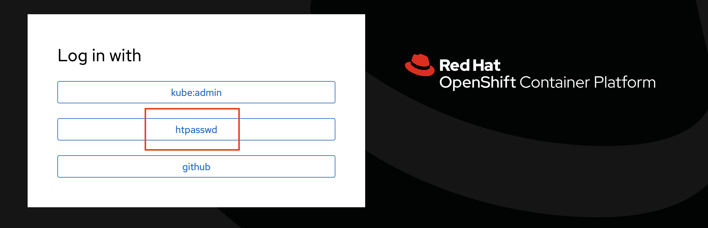
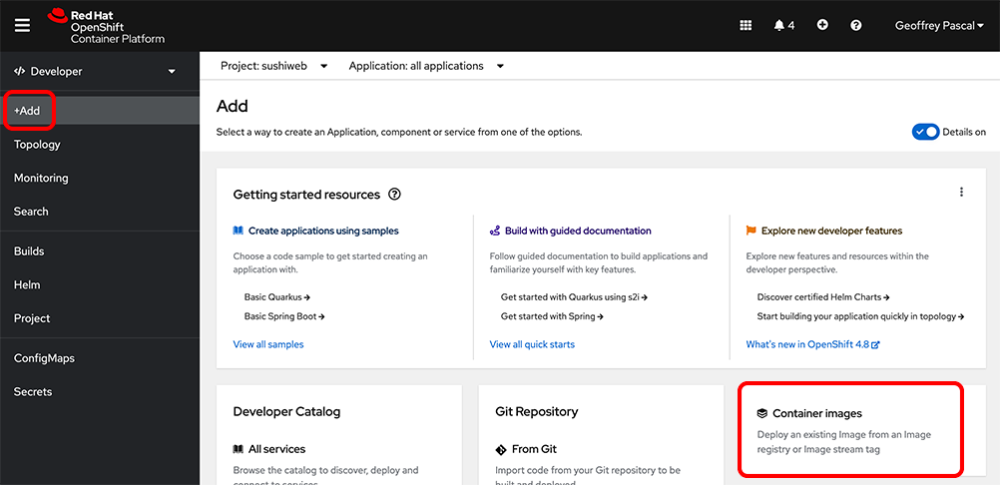
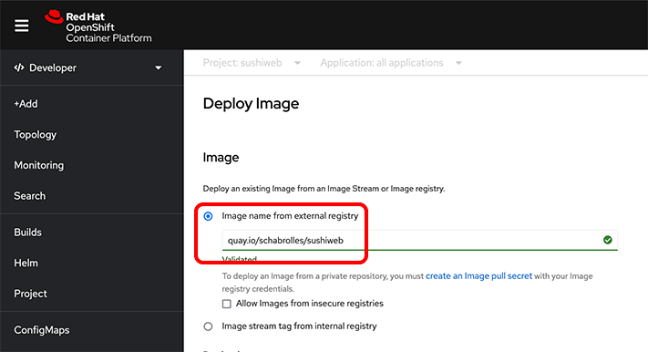
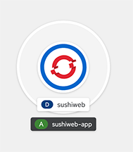
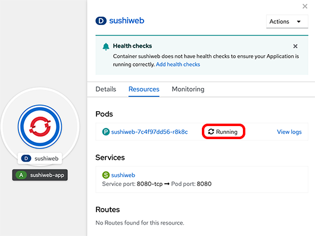
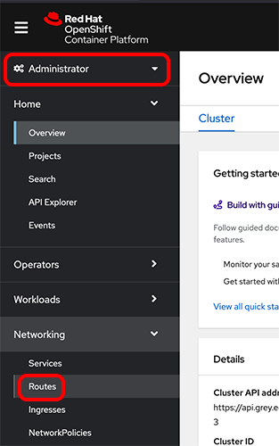
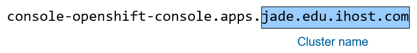
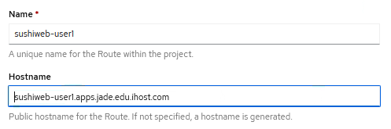

# Introduction

# Connect to the OpenShift Console

The first section will cover logging into the OCP server and navigating the interface.

1.	Open the Firefox web browser and open the web console URL.

2.	Select the htpasswd authentication method.

3. Use the user id and password to login

#	Deploy an existing image from Red Hat Quay

Red Hat® Quay is a private container registry that stores, builds, and deploys container images. It is the world's largest library and community for container images, organized by repositories and tags.

Major features are:
*	Repositories: Push and pull container images.
*	Teams & Organizations: Manage access to private repositories of container images.
*	Official Images: Pull and use high-quality container images provided by Docker.
*	Publisher Images: Pull and use high-quality container images provided by external vendors. Certified images also include support and guarantee compatibility with Docker Enterprise.

The goal of this first exercise is to deploy a container with a Docker image coming from the Red Hat® Quay. The image you will deploy is a simple website named Sushiweb, previously published by our team. An image name is made up of slash-separated name components, optionally prefixed by a registry hostname.

1.	Open a web browser and check the URL of the Red Hat® Quay:

https://quay.io/repository/schabrolles/sushiweb

Docker tags convey useful information about a specific image version/variant. It's basically meta-data you can use to distinguish versions of your Docker images.

2.	Click the “Tags” tab and inspect the tags available for this image. You will deploy the image with the tag “1:0”.

##	Find your Openshift project

A project is a Kubernetes namespace with additional annotations and is the central vehicle by which access to resources for regular users is managed. A project allows a community of users to organize and manage their content in isolation from other communities.

1. In the developer view, go to `Topology` and select `All Projects` to get a list of all your assigned projects.

2. Search for the project named `userX-sushi` and click on the project name. 

3. There should be no deployments under this project yet.

##	Deploy the docker image

1. In the Developer view, `Add` and select `Container Images`

3. Check the `Image Name from external registry` field and enter: `quay.io/schabrolles/sushiweb` for the image name.

4. Scroll down and enter `sushiweb-app` for the `Application Name` and enter `sushiweb` for the `Name`, uncheck “`Create a route to the application` box (It’s checked by default), we will create it later then click `Create`.

5. Click on `Sushiweb` to check the deployment status.

6. Check that the pod is in `Running` status.

## Create a route to reach the website

#### Services

An application is deployed in a pod on a node, but what happens when a node dies? The pods die with it, and the Deployment will create new ones, with different IP addresses. This is the problem a Service solves.

A Kubernetes service serves as an internal load balancer. It identifies a set of replicated pods in order to proxy the connections it receives to them. Backing pods can be added to or removed from a service arbitrarily while the service remains consistently available, enabling anything that depends on the service to refer to it at a consistent internal address. When created, each Service is assigned a unique IP address (also called clusterIP) internal to the OpenShift cluster. This address is tied to the lifespan of the Service and will not change while the Service is alive. Pods can be configured to talk to the Service and know that communication to the Service will be automatically load-balanced out to some pod that is a member of the Service.

### Routes

An OpenShift route is a way to expose a service by giving it an externally-reachable hostname like www.example.com, so that external clients can reach it by name. In OCP cluster, the route is created by the administrator. It runs an HAProxy on Infrastructure Node. This proxy associates a user-chosen hostname with the relevant service for the application we want to access.

1.	Switch back to `Administrator` view. click `Administrator` to create a route to allow incoming network access to your pod:

2. Click on the `Create Route`button

3. Set the Name to `sushiweb`, the Hostname to `sushiweb.apps.grey.edu.ihost.com`, select the `sushiweb` Service and Target Port to 8080 -> 8080 (TCP).

4. Scroll down to display the buttons and click `Create`.

5. Check for the `Accepted` status.

You can click the route link http://sushiweb.10.0.190.99.nip.io to validate the application is serving http request.

You will be connected to the sushiweb website.

This conclude the first part of the hands-on lab.

You have successfully deployed a container built by a user from an external public container registry on your OpenShift cluster.
