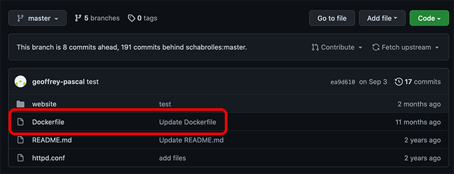

# Introduction

Let’s say you want to make your own Sushiweb website. You need to rebuild your own container from the application sources with your modifications. Luckily, Openshift provides several features to help you in the build process and delivery of the application to the end users

In the following exercise you will pull the Sushiweb source code from Github, then build and deploy the container image in your Openshift cluster. Once the website is deployed you will pull a new development version from Github and live update your running
pods.

The Sushiweb website sources are hosted on Github, you can check the directory structure of the project with this URL: https://github.com/geoffrey-pascal/sushiweb

As you can see, this project contains a Dockerfile file describing how to build the image of the application. Openshift can automatically run this file, build a container image and push it to its private registry.

#	Build a website container from Dockerfile

## Create a new project

1. First, go back to the `Developer`view

2. Select Project: `sushiweb` and click  `Create Project`

3. Enter Name `sushiweb-sources` and  click `Create`

## Create an OpenShift deployment from Github source code

1.	Click `+Add` and `From Dockerfile`

Enter `https://github.com/geoffrey-pascal/sushiweb` for the Git Repo URL.

2. Click `Show advanced Git options` and put `ubi8` in the `Git reference` field

3. Scroll down, set the name to `sushiweb-sources` and click `Create`.

4. Click on `sushiweb-sources` to check the Deployment status

When the pod is in `Running`. state, click the link to the route, check your website availability:

You will be connected to the deployed web site.

## Scale the application

1.	In the OpenShift web console, click `Developer / Topology` in the left Pane.

2. Click on `sushiweb-sources` to display the Deployment, select the `Details` tab.

Now Scale your application from 1 pod to 3 pods

3.	Switch to the `Resources` tab:

You should now see 3 pods deployed and can access to the logs of each pod:

You can see your 3 pods are serving requests in parallel.

#	Experiment Rolling updates

Let’s say a developer has created a new version of Sushiweb v1.0 and your job is to deploy this updated version.

Check GitHub to discover the new branch: https://github.com/geoffrey-pascal/sushiweb/branches

1. Click on `Builds` and select the `sushiweb-sources` build.

2. Click `Edit Build Config` in the upper right corner:

3. The git field contains the URI to the remote Git repository of the source code, to check out a specific Git add a line `ref: v1.0` after the `uri: 'https://github.com/geoffrey-pascal/sushiweb'`, This branch contains the new development version of Sushiweb, click `Save`

4. Click `Start build` to start the build process again:

In the OpenShift web console, click `Topology` in the left pane.

Click on `sushiweb-sources` to display the sushiweb-sources Deployment, select the `Resources` tab.

There are 2 Builds in complete status, click on `View logs` to see the log stream.

Check the new website deployed. You may need to refresh your browser cache to see the updated content (The headings of the website should be displayed in blue).
