# Introduction

It is a more advanced example with the deployment of a NodeJS web application connected to a MongoDB backend.
You can get an overview of the app in the Github project: https://github.com/geoffrey-pascal/lets-chat

#	Deploy a multi-tier Application composed of NodeJS application and a MongoDB backend

## Select a project

1. First, go back to the `Topology` view and select `Topology`

2. Select project `user1-chat`

## Deploy MongoDB

1. Click `+Add` and `All services` from `Developer catalog`

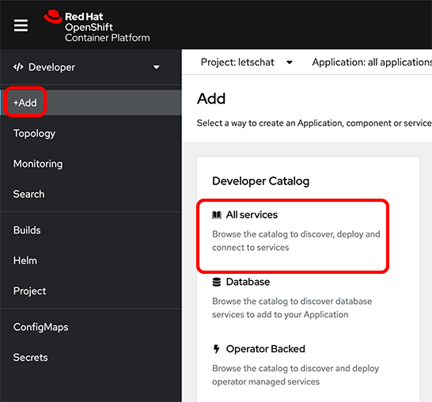

3. Filter the output with `mongodb` string.

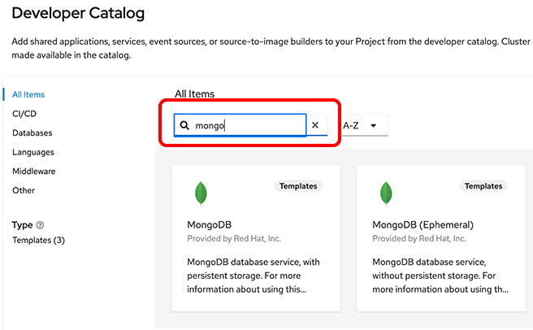

4. Select the service `MongoDB (Ephemeral)``

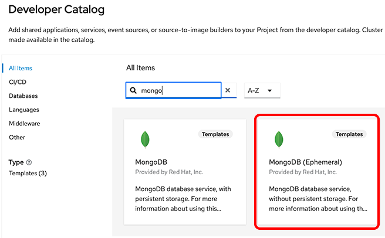

5. Click `Instantiate Template`

6. Check the following informations are set in the fields and click `Create`

*	Namespace: openshift
*	Database Service Name : mongodb
*	MongoDB Connection Username: mongouser
*	MongoDB Connection Password : password
*	MongoDB Database Name : sampledb
*	MongoDB Admin Password: mongoadm
*	Version of MongoDB Image : 3.6

7. Check the status of the Pod, click `Topology`, click DeploymentConfig `mongodb`

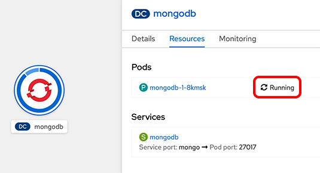

You deployed a new MongoDB instance into your project. This instance as it’s suggested by the name is ephemeral meaning that the data are not persistent when you restart the instance. This service should only be used for development purpose.

##	Deploy NodeJS application

1. Click `+Add`

2. Select `From Git`

3. Enter `https://github.com/geoffrey-pascal/lets-chat` for the `Git Repo URL`

4. Click `Show advanced Git options`and enter `dev`in the Git reference field.

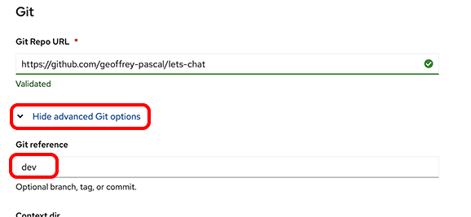

5. Openshift automatically detects that it is a NodeJS application. Check that the builder image is Nodejs 14 UBI 7.

6. Click “Create”.

7. From the `Topology` view click on `letschat` to check the Deployment status.

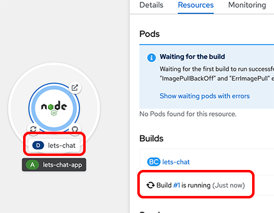

The NodeJS application requires the credentials to connect to the MongoDB database. The credentials are stores into a Kubernetes object called `Secret`.

8. Click `Secrets`from the left pane and filter with `mongo`keyword in the name search field.

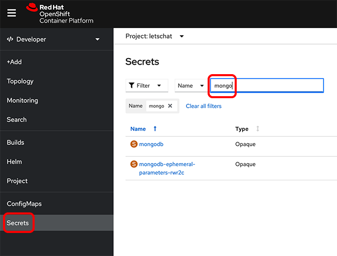

9. Click the `mongodb`secret.

10. Add this secret to the NodeJS application by click on `Add Secret to workload`

11. Select `letschat` in the workload list and click `Save`

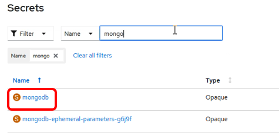

12. When the application deployment is completed `Build #1 is complete`, try to connect to the application by clicking on the Open URL button from the `Topology` view.

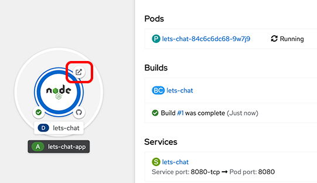

13. First, create an account when the login screen is displayed in the letschat application.

14. Click `I need an account`

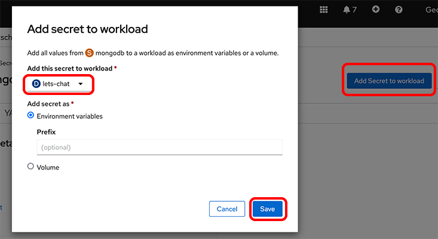

15. Set dummies values for the account, remember the username and the password you will need to login into the application and click `Register`

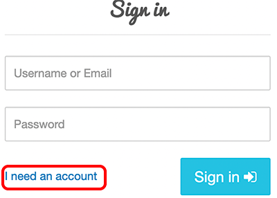

16. Try to login with your username and password.

Now you should be able to use the application. You can see that your NodeJS chat application is successfully connected to the MongoDB instance and the application is accessible via an http url.

This conclude this hands-on lab.
