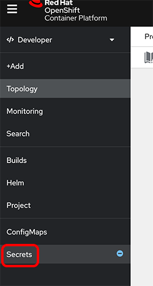
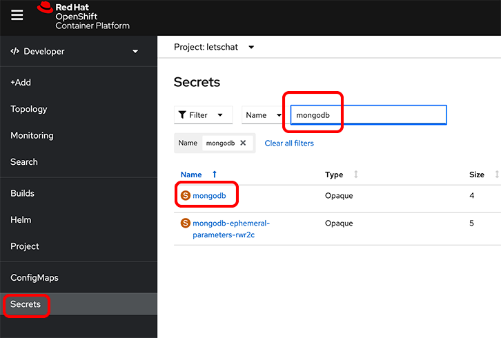
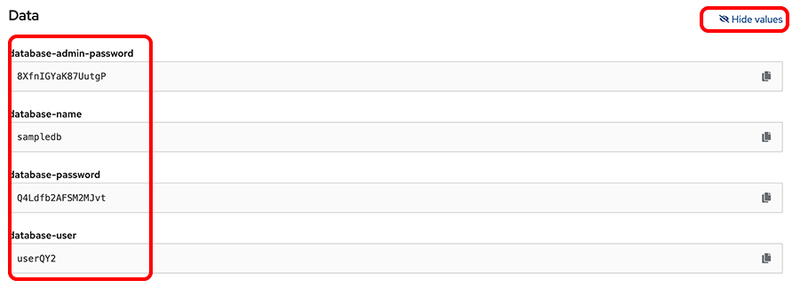
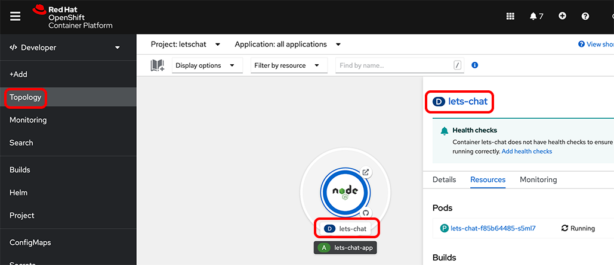
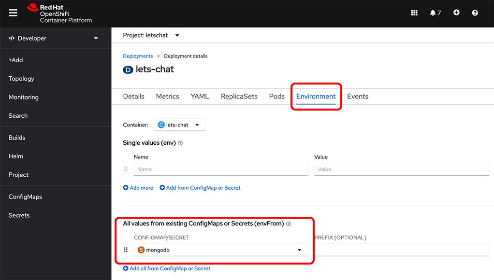
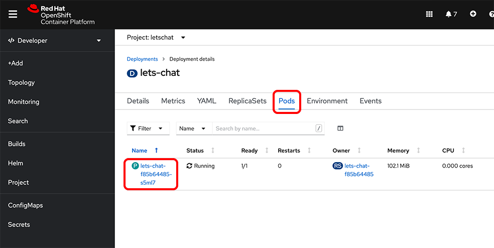
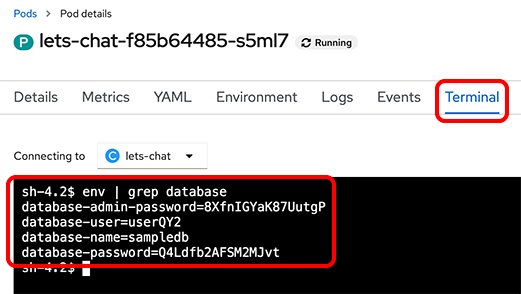
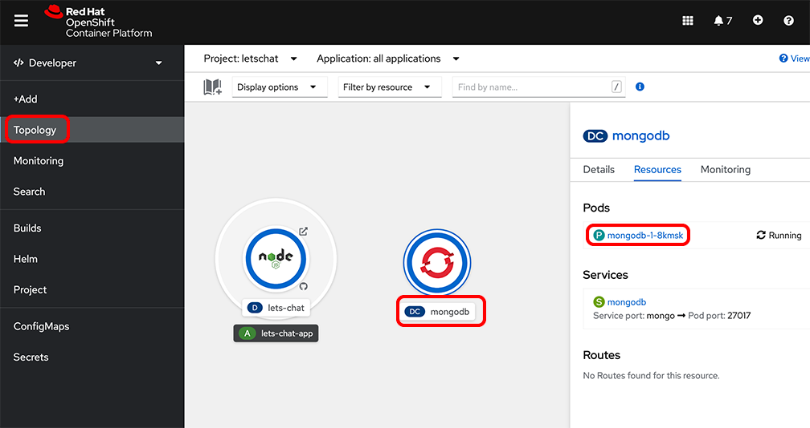
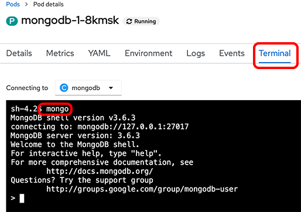
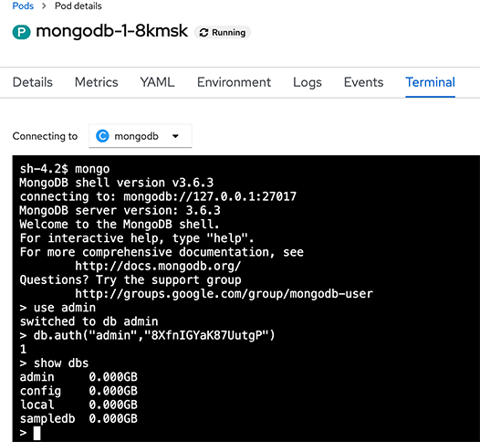

# Introduction

It is a more advanced example with a deployed NodeJS web application connected to a MongoDB backend.
In this hands-on lab you will use the web console to inspect the running application.

# Connect to the OpenShift Console

1.	Open the Firefox web browser and open the web console URL.

2.	Select the htpasswd authentication method.

3. Use the user id and password to login

# Explore the information stored into the secret

1. Click the `Secret` tab in the left panel

2. Filter the names to find the `mongodb` secret and click on it.

3. Scroll down and click on `Reveal values`

You can see that Openshift created some random values if you didn't filled the form in the previous part of the tutorial.

You can find in this secret:

* `database-admin-password`
* `database-name`
* `database-password`
* `database-user`

For the following of the tutorial copy the `database-admin-password`.

4. To better understand how the application can access the content of the secret. Go back to the `Topology` view and click the `letschat` deployment

5. Open the `Environment` tab and check that the secret is correctly linked to the application

6. Click on the `Pods` tab and click the pod name

7. Click on the `Terminal` tab and run the command: `env | grep database`

You connected to the running container of the NodeJS application and you can see that the content of the secret is available as environment variables. The application can then read these variables to connect to the database.

For reference this is how to read an environment variable from a NodeJS application: `process.env['database-user']`

# Explore the data stored in the MongoDB database

This application is using a MongoDB database, it's very convenient during the development to connect to the database and check the data created by the application. You will see how easy it is to do so with the Openshit Console.

1. First, go back to the `Topology` view and open the MongoDB pod.

2. Open the `Terminal` tab and type the following command: `mongo`

3. You are now connected to the MongoDB shell. Run the following commands to login into the database:

* `use admin`
* `db.auth("admin","<password from secret>")`

If you missed to copy the `database-admin-password` from the secret repeat the step of the previous chapter.

4. Use the command `show dbs` to list the databases available. If you didn't changed the default values, you should see a `sampledb` listed. Otherwise use the name of the database you created.

5. Connect to this database and run few commands to check what is stored in the collections. Run the first command: `use sampledb` and then `show collections`.

You should see a list of five collections:

* messages
* rooms
* sessions
* usermessages
* users

6. To query these collections you can use the following command: `db.<collection name>.find()`, for example if you want to check the user you created in the previous part, run the following command: `db.users.find()`.

You should see a JSON object with the user you created.

This conclude the second part of the hands-on lab.
