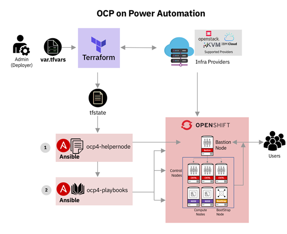
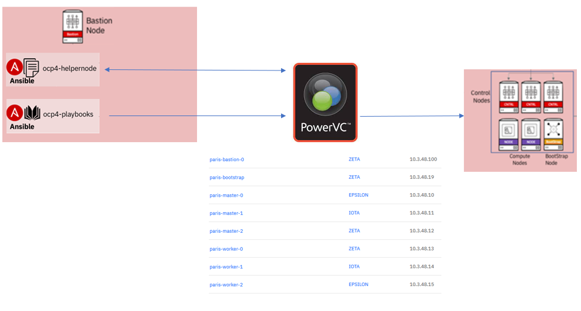
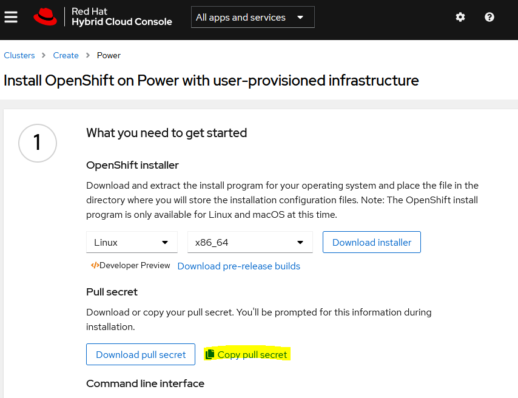
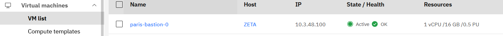
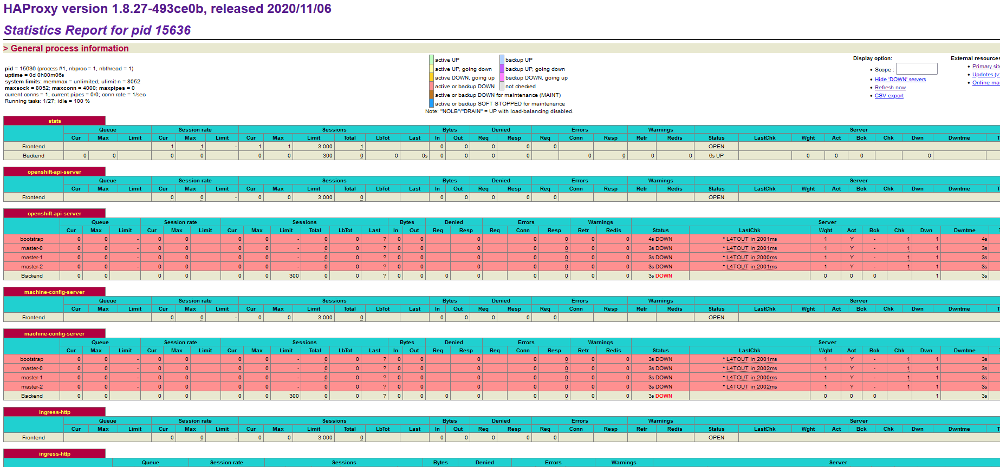
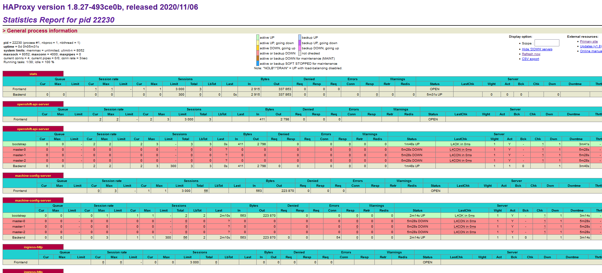
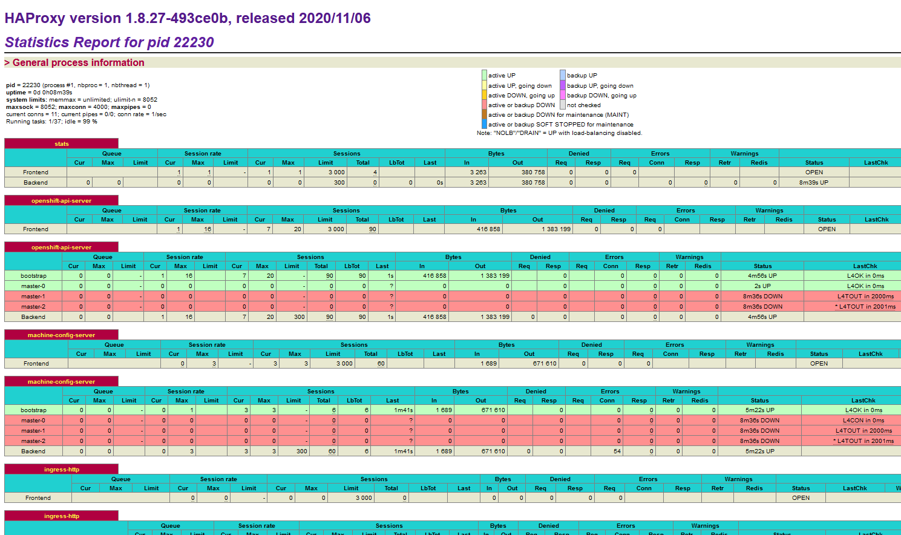
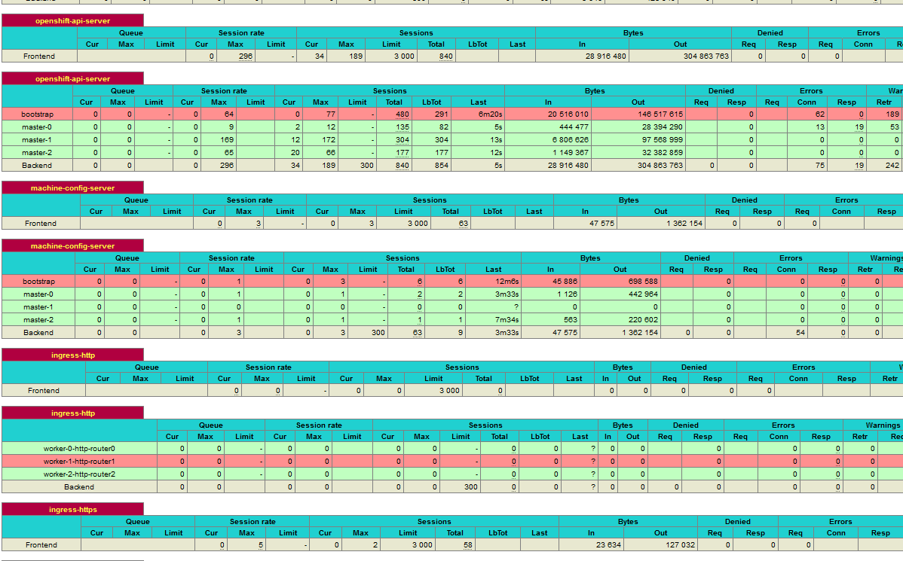
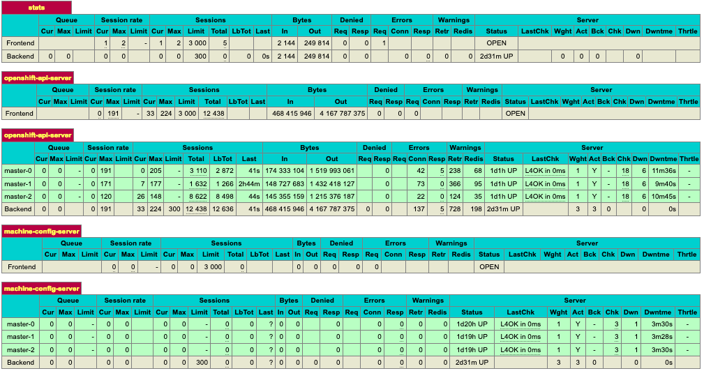

# Install of an Openshift cluster through PowerVC

## Check the environment

* Activate openvpn
* To check it is working properly, make sure you can access the PowerVC : <https://powervc.paris.edu.ihost.com:4443>
* The manager's ip (that hosts the terraform) is 10.3.48.3
to access it :

```sh
ssh you_provided_user@10.3.48.3 
```

```text
password : your_provided_password
```

The terraform is on the manager's vm (distinct from the VM on which the PowerVC runs).
It takes the var.tfvars file in input and will generate a tfstate file.

The ansible playbooks (1) and (2) will be on the bastion once it is deployed. They will run to automatically create the cluster as stated in the tfstate file.



The ansible helpernode playbook will prepare the bastion for the cluster and will set its environment.
The other ansible playbook will be generated next and will set the nodes to create the cluster.



## 1) Cluster installation

Now, we can clone the git repository.

```sh
git clone https://github.com/ocp-power-automation/ocp4-upi-powervm
```

```text
Cloning into 'ocp4-upi-powervm'...
remote: Enumerating objects: 1732, done.
remote: Counting objects: 100% (448/448), done.
remote: Compressing objects: 100% (186/186), done.
remote: Total 1732 (delta 284), reused 398 (delta 262), pack-reused 1284
Receiving objects: 100% (1732/1732), 424.05 KiB | 2.08 MiB/s, done.
Resolving deltas: 100% (1038/1038), done.
```

```sh
le
```

```text
ocp4-upi-powervm 
```

We now have to work in the ocp4-upi-powervm directory

```sh
cd ocp4-upi-powervm
```

Copy the customized tfvar sample

```sh
cp /home/samples/sample_demo.tfvars ~/ocp4-upi-powervm/paris.tfvars

```

Initialize terraform

```sh
terraform init -plugin-dir /usr/local/terraform/
```

Then, in the data directory, we need to copy the SSH key-pair and the pull-secret.txt.
Your personnal Openshift pull secret, is available at :

[https://cloud.redhat.com/openshift/install/power/user-provisioned](https://console.redhat.com/openshift/install/power/user-provisioned)



Once copied, it must be pasted in the data/pull-secret.txt file.

```sh
vi ocp4-upi-powervm/data/pull-secret.txt
```

Create an ssh key, and copy it into the data directory

```sh
ssh-keygen -q -t rsa -N '' -f ~/.ssh/id_rsa
cp ~/.ssh/id_rsa* ocp4-upi-powervm/data/
```

Now, you have to edit the paris.tfvars file. The minimum requirement is to accomodate the user and password as
they have been provided to you by Techzone.
You can find how to customize the tfvars file here: [Customize the tfvar file](tfvars.md)

Once done:

```sh
terraform apply -var-file paris.tfvars
```

Answer 'yes' when prompted

The terraform script will create the VMs as specified in the demo.tfvars file.

## 2) Monitoring the installation

### a) command lines on the bastion

Once the apply command is launched, we need to wait for the bastion to be fully deployed.
One can see the progress of the install of the bastion on PowerVC. For that, see Virtual Machines -> VM list.


The ip adress of the bastion is specified in the paris.tfvars file, as well as in the powervc (vm list -> network). From the manager's vm, one can access the bastion through ssh once it is properly deployed.

```sh
ssh root@10.3.48.100
```

>:warning: The openstack repository might take some time to be created (the helpernode and then the playbooks repo should be created first).

Wait for the openshift-install command is available :

```sh
which openshift-install
```

```text
/usr/local/bin/openshift-install
```

Check that the openstack-upi directory as been created :

```sh
ls -ld ~/openstack-upi/
```

Add the bash completion for both the openshift-install and oc commands :

```sh
oc completion bash > /etc/bash_completion.d/oc
openshift-install completion bash > /etc/bash_completion.d/openshift-install

source /etc/bash_completion.d/oc
source /etc/bash_completion.d/openshift-install
```

* To follow the installion progress of the bootstrat, once in the openstack repository :

```sh
cd ~/openstack-upi/
openshift-install wait-for bootstrap-complete --log-level debug
```

* To follow the step of the installation progress :

```sh
~/openstack-upi/
openshift-install wait-for install-complete --log-level debug
```

* Check the installation :

```sh
export KUBECONFIG=~/openstack-upi/auth/kubeconfig
watch -n 15 "oc get clusterversions ; echo ; oc get co"
```

### b) Check the apis and nodes from the bastion's ha_proxy

HA proxy to follow the installation, once the bastion is deployed : <http://10.3.48.100:9000/>

* At first, all the other machines will still be red, because not deployed yet.


* Then, the bootstrap will be deployed next. It will compose a mini cluster on its own.


* After the bootstrap come the masters that will join it in the cluster.


* Then come the workers. Once the masters are all deployed, the bootstrap will terminate, since it is no longer userful.


## 3) Check that you can access your new cluster

To get the password to access the cluster, type on the bastion

```sh
cat openstack-upi/auth/kubeadmin-password
````

<https://console-openshift-console.apps.paris.edu.ihost.com/>

>username : kubeadmin \
>password : in openstack-upi/auth/kubeadmin-password

The Openshift console shows up like:


## 4) Extra final step, remove the bootstrap node

### a) Edit the tfvar file

Edit the tfvar file and change the bootstrap count from 1 to 0 :

```text
bootstrap = {instance_type = "master", image_id = "8d20f462-260f-4715-9b95-6a63aad698e3", "count" = 0, fixed_ips = ["10.3.48.19"]}
```

### b) Re-run the terraform script

```sh
terraform apply -var-file paris.tfvars
```

Answer 'yes' when prompted

After the bootstrap node gets properly remove, the ha_proxy will show the following :


You've completed the demo lab !

> You can find a complete documentation of the Terraform deployment at the [ocp4-upi-powervm
 github](https://github.com/ocp-power-automation/ocp4-upi-powervm#readme)
